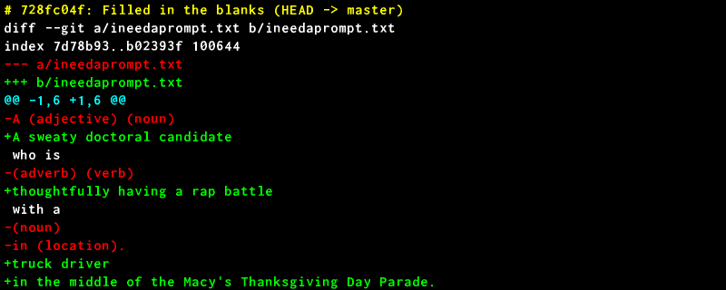

# Diffshot

Loops through a Git log and outputs a .png of the diff of each file in each commit.

Useful for writing coding tutorials, and understanding what you did.

## Installation

```sh
$ npm install -g diffshot
```

## Usage

```sh
$ cd my-git-repo
$ diffshot
```

The result is a directory named `_DIFFSHOT` that contains a bunch of images like this:



...and a file named `README.md` that lists the text and images of each diff.

## Options

```sh
$ diffshot --help
diffshot [<options>] [<commit> [<commit>]] [--] [<path>...]
Loop through a Git log and output a .png of the diff of each file in each
commit.

Options:
  --help, -h           Show help                                       [boolean]
  --version, -v        Show version number                             [boolean]
  --filesToExclude              [array] [default: ["^.*-lock.json$","^.*.fnt$"]]
  --outputImagePath                              [string] [default: "_DIFFSHOT"]
  --outputDocPath                      [string] [default: "_DIFFSHOT/README.md"]
  --fontFile                                                  [string] [default:
                                    "~/npm-install-location/inconsolata_16.fnt"]
  --fontLineIndentPx                                       [number] [default: 5]
  --fontLineHeightPx                                      [number] [default: 20]
  --fontColorMain                                   [string] [default: "ffffff"]
  --fontColorDelete                                 [string] [default: "ff0000"]
  --fontColorAdd                                    [string] [default: "00ff00"]
  --fontColorHeadline                               [string] [default: "ffff00"]
  --fontColorMeta                                   [string] [default: "00ffff"]
  --imageWidthPx                                         [number] [default: 800]
  --imageBgColor                                    [string] [default: "000000"]
```

The font must be a bitmap font / `.fnt` file.

## Contributing

Yes, please! :)
